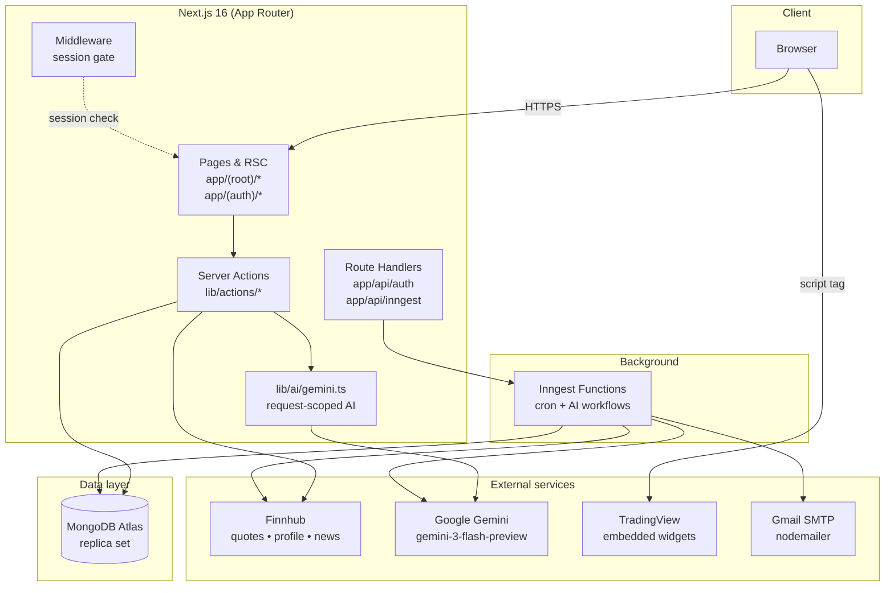
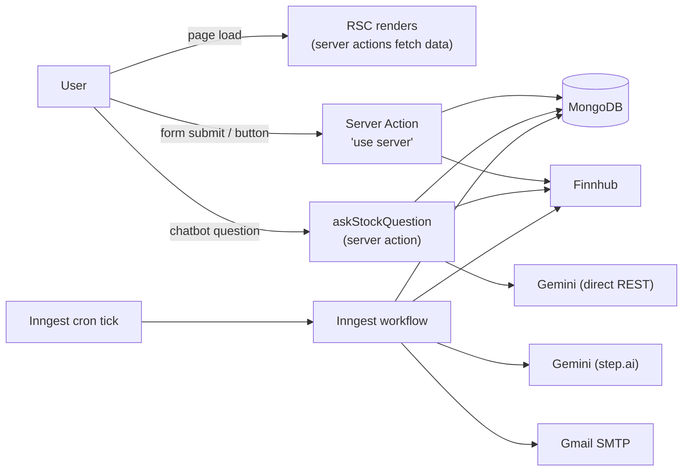
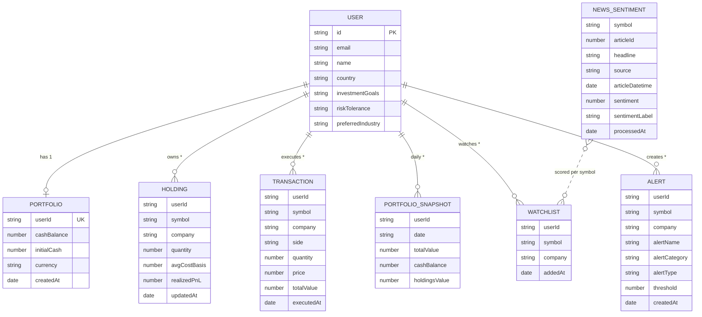

# Architecture

High-level view of how WealthFlow is built. Companion to [`PIPELINES.md`](PIPELINES.md) (sequence diagrams of the most interesting flows) and [`METHODOLOGY.md`](METHODOLOGY.md) (why these pieces were chosen).

---

## 1. System overview



**Reading the diagram, left-to-right by responsibility:**

- **Client** — browser only. No business logic.
- **Next.js app** — does the work. Pages are React Server Components by default; Server Actions are the only mutation surface. Middleware gates protected routes via the better-auth session cookie.
- **Background** — Inngest hosts all crons + durable AI workflows. Decoupled from request lifecycle.
- **Data layer** — single MongoDB Atlas cluster (replica set required for the trade-execution transactions).
- **External services** — Finnhub for market data, Gemini for AI, TradingView for embedded charts, Gmail for outbound mail.

---

## 2. Request paths at a glance



**Two AI integration paths, on purpose:**

| Path | Use case | Why |
|---|---|---|
| `lib/ai/gemini.ts` (direct REST) | Per-stock chatbot, sentiment scoring | Request-scoped — user is waiting. Low latency. Structured JSON via `responseSchema`. |
| `step.ai.gemini` (Inngest) | Welcome email, daily news, weekly recap | Background — durability matters more than latency. Built-in retries, traced steps. |

---

## 3. Layer breakdown

```
app/
├── (auth)/                   ← unauthenticated routes (sign-in, sign-up, forgot/reset password)
├── (root)/                   ← protected routes (gated by middleware)
│   ├── page.tsx              ← dashboard
│   ├── stocks/[symbol]/      ← detail + chatbot + sentiment chart
│   ├── watchlist/            ← watchlist + alert management
│   ├── portfolio/            ← summary cards + equity curve + sector pie + holdings + tx history
│   └── leaderboard/          ← ranked by all-time return %
└── api/
    ├── auth/                 ← better-auth Route Handler
    └── inngest/              ← serve() entry, registers all Inngest functions

lib/
├── actions/                  ← server actions (one file per domain)
│   ├── auth.actions.ts
│   ├── watchlist.actions.ts
│   ├── alert.actions.ts
│   ├── portfolio.actions.ts  ← trade, snapshot, equity curve, leaderboard
│   ├── chat.actions.ts       ← askStockQuestion
│   ├── sentiment.actions.ts  ← scoreArticles, processWatchlistSentiment, timeline, summary
│   ├── recap.actions.ts      ← buildWeeklyRecapContext
│   ├── finnhub.action.ts     ← getStockQuote, getCompanyProfile, searchStocks, getNews
│   └── user.actions.ts
├── ai/
│   └── gemini.ts             ← direct REST helper (askGemini)
├── inngest/
│   ├── client.ts
│   ├── functions.ts          ← all Inngest function definitions
│   └── prompts.ts            ← welcome / news / recap / sentiment prompts
├── better-auth/auth.ts
├── nodemailer/{index.ts,templates.ts}
└── utils.ts, constants.ts

DATABASE/
├── mongoose.ts               ← cached connection (IPv4-forced for DNS reliability)
└── models/
    ├── watchlist.model.ts
    ├── alert.model.ts        ← extended with alertCategory ('price' | 'sentiment')
    ├── portfolio.model.ts
    ├── transaction.model.ts
    ├── holding.model.ts
    ├── portfolio-snapshot.model.ts
    └── news-sentiment.model.ts

components/                   ← React components (server + client)
hooks/                        ← useDebounce, useTradingViewWidget
middleware/index.ts           ← session-cookie route guard
types/global.d.ts             ← all global types
```

---

## 4. Data model



**Index strategy (the ones that matter):**

| Collection | Index | Purpose |
|---|---|---|
| `holdings` | `(userId, symbol)` unique | One position per user per stock; idempotent upserts |
| `transactions` | `(userId, executedAt desc)` | History queries |
| `portfoliosnapshots` | `(userId, date)` unique | Daily cron upsert idempotency |
| `portfoliosnapshots` | `(userId, date desc)` | Equity-curve range queries |
| `watchlists` | `(userId, symbol)` unique | Prevent duplicates on add |
| `alerts` | `(userId, symbol)` | Per-user listings |
| `newssentiments` | `(symbol, articleId)` unique | Cron idempotency — re-runs don't duplicate |
| `newssentiments` | `(symbol, articleDatetime desc)` | Timeline aggregation |

**Notable design decisions:**

- **`NEWS_SENTIMENT` has no `userId`** — sentiment per stock is shared across all users. Many users watching AAPL don't trigger N redundant scoring jobs.
- **`HOLDING.realizedPnL`** — kept on the document so closing a position then re-buying doesn't lose the historical realized gain. Holdings with `quantity == 0` are retained for this reason; UI filters them out.
- **`PORTFOLIO_SNAPSHOT.date` is a `YYYY-MM-DD` string** — chosen over a `Date` type so the unique compound `(userId, date)` index naturally enforces "one snapshot per day" without timezone math.
- **`ALERT.alertCategory` defaults to `'price'`** — additive schema change, no migration needed, all read paths fall back safely.

---

## 5. Cross-cutting concerns

- **Auth** — better-auth (MongoDB adapter). Middleware checks for the session cookie on every `(root)` request and redirects to `/sign-in` if missing.
- **Atomicity** — `executeTrade` runs inside a `mongoose.startSession().withTransaction()` block. Three writes (Portfolio cash, Holding upsert, Transaction insert) either all commit or all roll back. Required even for paper trading because partial failure would silently lose money.
- **Idempotency** — every cron is safe to re-run: snapshot job uses `upsert` keyed on `(userId, today)`, sentiment job pre-checks already-scored `articleId`s + relies on the unique index, alert crons delete fired alerts so they only trigger once.
- **Dedupe across users** — sentiment cron, snapshot cron, and leaderboard each compute a `Set` of unique symbols across all users before hitting Finnhub or Gemini. Cuts external API calls roughly N-fold.
- **Network resilience** — `lib/actions/finnhub.action.ts` wraps every fetch with `AbortSignal.timeout(5000)` and converts timeouts into a clear `Finnhub request timed out after 5000ms` error. Per-symbol catches in callers degrade gracefully (empty data, page still renders).
