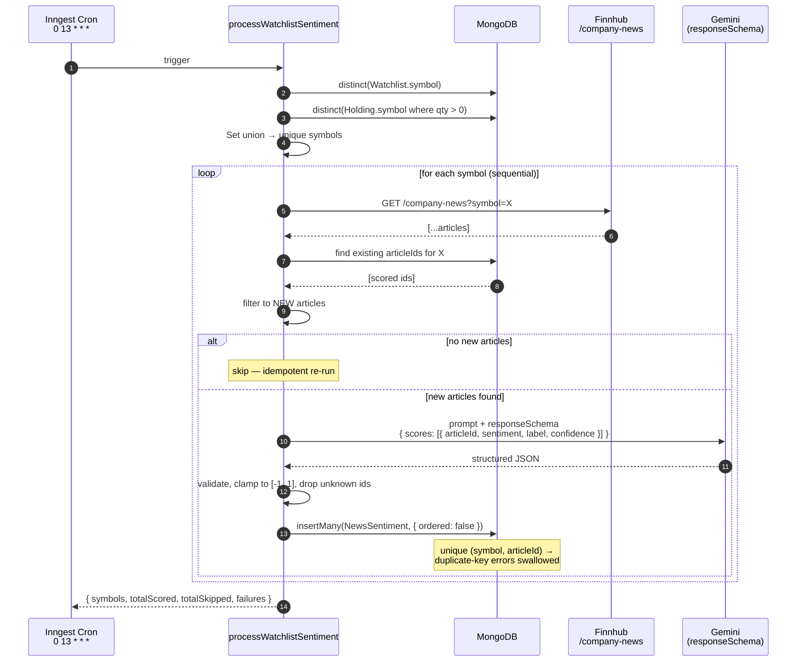
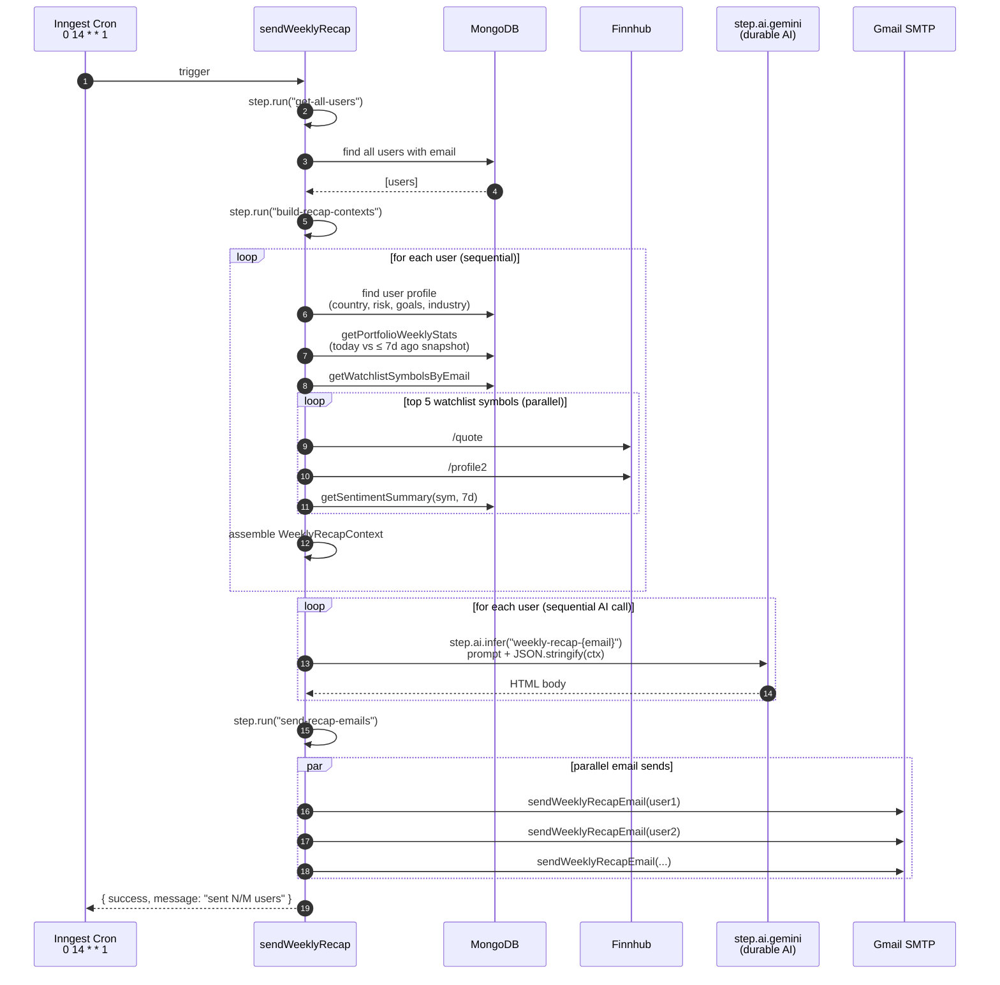
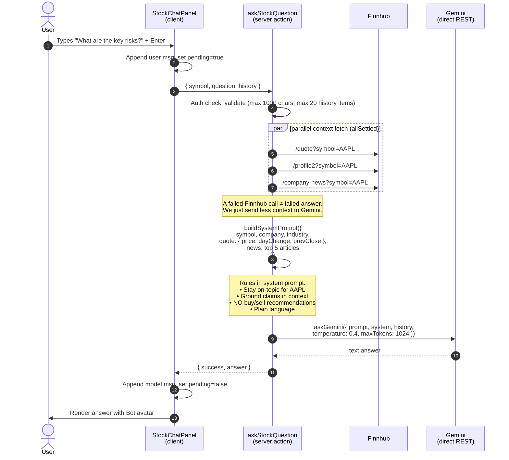

# Pipelines

Sequence diagrams for the four most interesting flows in WealthFlow. These are the slides you'll want to spend the most time on during the demo — they show the depth that isn't visible just by clicking around.

Flows covered:
1. [Trade execution (atomic, MongoDB transaction)](#1-trade-execution--atomic-with-mongodb-transaction)
2. [News sentiment pipeline (daily cron + Gemini structured output)](#2-news-sentiment-pipeline--daily-cron--ai-scoring)
3. [Weekly AI recap email (multi-step Inngest workflow)](#3-weekly-ai-recap-email--multi-step-inngest-workflow)
4. [Stock chatbot grounding (request-scoped AI)](#4-stock-chatbot-grounding--request-scoped-ai)

---

## 1. Trade execution — atomic with MongoDB transaction

The user clicks **Buy 5 AAPL**. Three writes have to happen consistently — debit cash, upsert the holding (with weighted-average cost basis), insert a transaction row. A crash between any of them would silently lose money. We wrap it in a real MongoDB transaction.

```mermaid
sequenceDiagram
    autonumber
    actor User
    participant TradeModal as TradeModal<br/>(client)
    participant Action as executeTrade<br/>(server action)
    participant Finnhub as Finnhub /quote
    participant Mongo as MongoDB Atlas<br/>(replica set)

    User->>TradeModal: Click "Buy 5 AAPL"
    TradeModal->>Action: { symbol, company, side, quantity }
    Action->>Action: Auth check, validate qty (positive integer)
    Action->>Finnhub: GET /quote?symbol=AAPL
    Finnhub-->>Action: { c: 187.45, ... }
    Action->>Action: totalValue = 187.45 × 5

    rect rgb(35, 50, 75)
        Note over Action,Mongo: mongoose.startSession() → withTransaction()
        Action->>Mongo: findOne(Portfolio, { userId }) [in tx]
        Mongo-->>Action: { cashBalance: 100000 }
        Action->>Action: assert cash ≥ totalValue
        Action->>Mongo: portfolio.cashBalance -= totalValue; save
        Action->>Mongo: findOne(Holding, { userId, symbol })
        alt new position
            Action->>Mongo: insert Holding { qty: 5, avgCostBasis: 187.45 }
        else existing position
            Action->>Action: weighted avg = (oldQty×oldCost + newQty×price) / total
            Action->>Mongo: update Holding { qty: newQty, avgCostBasis: avg }
        end
        Action->>Mongo: insert Transaction { side, qty, price, totalValue }
    end

    Mongo-->>Action: commit ✓
    Action->>Action: revalidatePath('/portfolio')
    Action-->>TradeModal: { success, executedPrice, totalValue }
    TradeModal->>User: Toast "Bought 5 AAPL at $187.45"
```

**Why a transaction matters:**
Atlas defaults to a replica set, which is the prerequisite for transactions. Without one, a process crash between step 8 and step 11 would deduct cash but leave no holding to show for it — silent money loss, even in paper trading. The transaction guarantees all-or-nothing.

**Cost-basis math:**
On a second buy, the avg cost is recomputed: `(oldQty × oldCost + newQty × price) / (oldQty + newQty)`. Sells decrement quantity and add `(price − avgCostBasis) × qty` to `realizedPnL` but **never** change `avgCostBasis` — standard weighted-average accounting. Holdings with `quantity == 0` are kept around so re-buying doesn't lose the historical realized gain.

---

## 2. News sentiment pipeline — daily cron + AI scoring

Every day at 13:00 UTC, Inngest collects every symbol anyone is watching or holding, fetches recent news, and asks Gemini to score each article on a `[-1, 1]` sentiment scale. Results are persisted for the timeline chart and sentiment-based alerts.



**Idempotency, layered twice:**
1. **App-level pre-check** — query `NewsSentimentModel` for already-scored `articleId`s in this batch and skip them before calling Gemini (saves API cost on every retry).
2. **DB-level** — unique compound `(symbol, articleId)` index plus `insertMany({ ordered: false })` so a race-condition duplicate is silently rejected without killing the whole batch.

**Why structured output (`responseSchema`):**
Gemini honours a JSON schema and returns deterministic `{ scores: [...] }` objects. Without it, we'd be reverse-engineering free text. With it, `JSON.parse` + a small validator is enough — and the validator is defensive (drops articleIds we didn't send, clamps sentiment outside `[-1, 1]`).

**Why sequential per symbol:**
Throughput doesn't matter for a once-a-day job. Sequential keeps Gemini and Finnhub under their per-second rate limits naturally and isolates failures — one bad symbol doesn't poison the rest.

---

## 3. Weekly AI recap email — multi-step Inngest workflow

Mondays at 14:00 UTC, every user gets a personalized email tying their portfolio's week-over-week change + watchlist movements + 7-day sentiment to their stated risk profile and preferred industry. This is the most multi-step workflow in the system.



**Why `step.ai` instead of the direct REST helper:**
Background work where retries and observability matter more than latency. If the Gemini call for user 7 fails, Inngest retries that step automatically — and the step name (`weekly-recap-{email}`) shows up in the trace, so you can see exactly where things went wrong.

**Per-user error isolation:**
The "build-recap-contexts" loop catches per-user errors and continues. The AI loop catches per-user errors and continues. The send loop uses `Promise.all` over `try/catch` per send. Result: one user's broken state never blocks the rest.

**No 7-day historical prices in the watchlist context:**
Finnhub's free tier doesn't expose historical candles via `/quote`. We compensate with current price + today's % change + 7-day sentiment summary — enough material for the AI to write meaningful commentary without inventing numbers.

---

## 4. Stock chatbot grounding — request-scoped AI

Per-stock chatbot powered by Gemini. The user types, the server fetches live context (quote + profile + recent news) in parallel, builds a grounded system prompt, and calls Gemini directly (not via Inngest — request-scoped, low latency).



**Why direct REST instead of `step.ai`:**
The user is staring at a "Thinking…" spinner. We need the answer in seconds, not Inngest's eventual-delivery semantics. The direct REST helper (`lib/ai/gemini.ts`) gives us tight control over timeout (`AbortSignal.timeout(25000)`) and surfaces errors as toast notifications.

**Why `Promise.allSettled`, not `Promise.all`:**
If Finnhub is briefly unreachable, `all` would throw and the user would get an error. `allSettled` lets the action continue with whatever context succeeded — degraded but useful answer over an unhelpful error.

**Anti-recommendation guardrail in the system prompt:**
"DO NOT give personalized buy/sell/hold recommendations." The model still discusses *factors* that might inform a decision (and it does so well), but it won't say "buy AAPL." Important for the regulatory framing of any investment-adjacent product.

**Why temperature 0.4:**
Lower than the default 0.7. The chatbot is doing research-grounded Q&A, not creative writing — we want it sticking close to the context, not inventing optimistic narratives.
