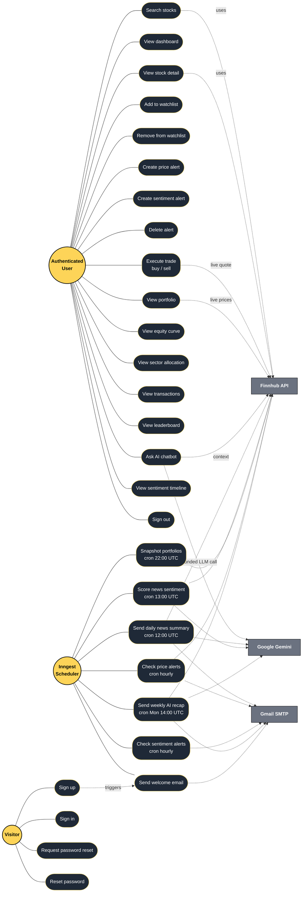
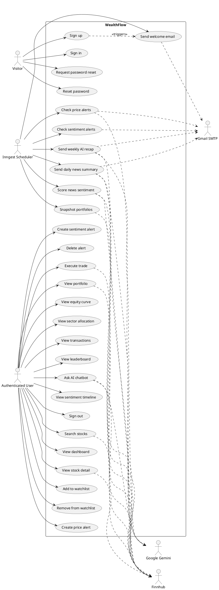
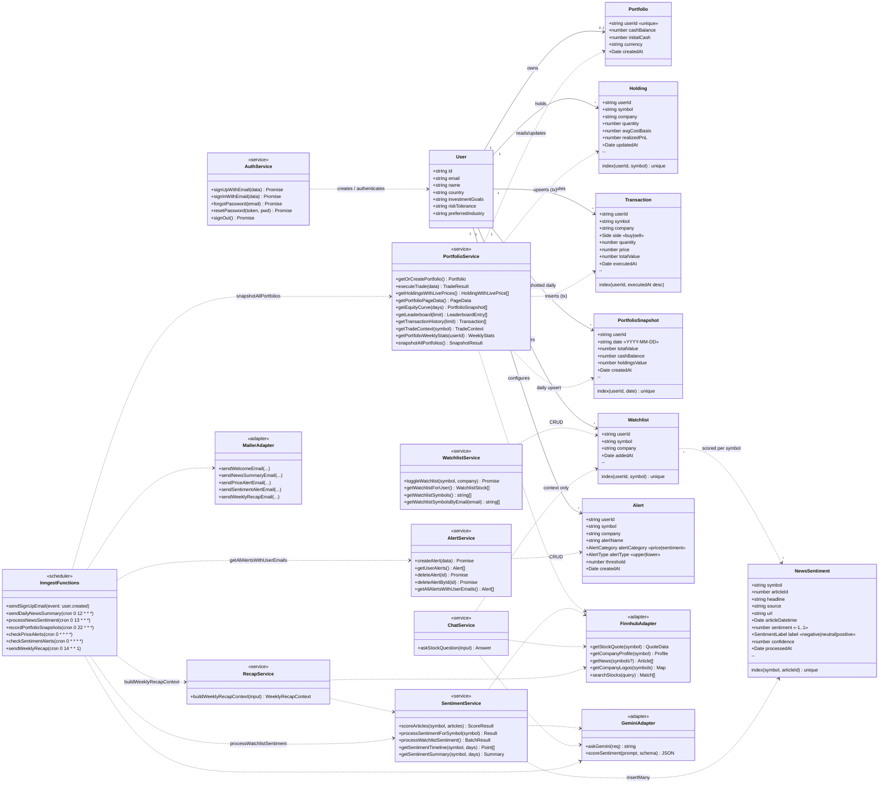
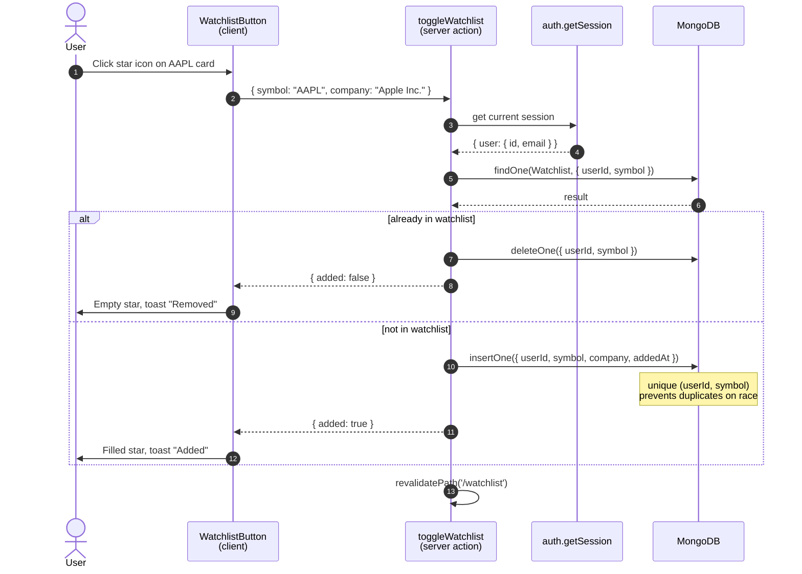
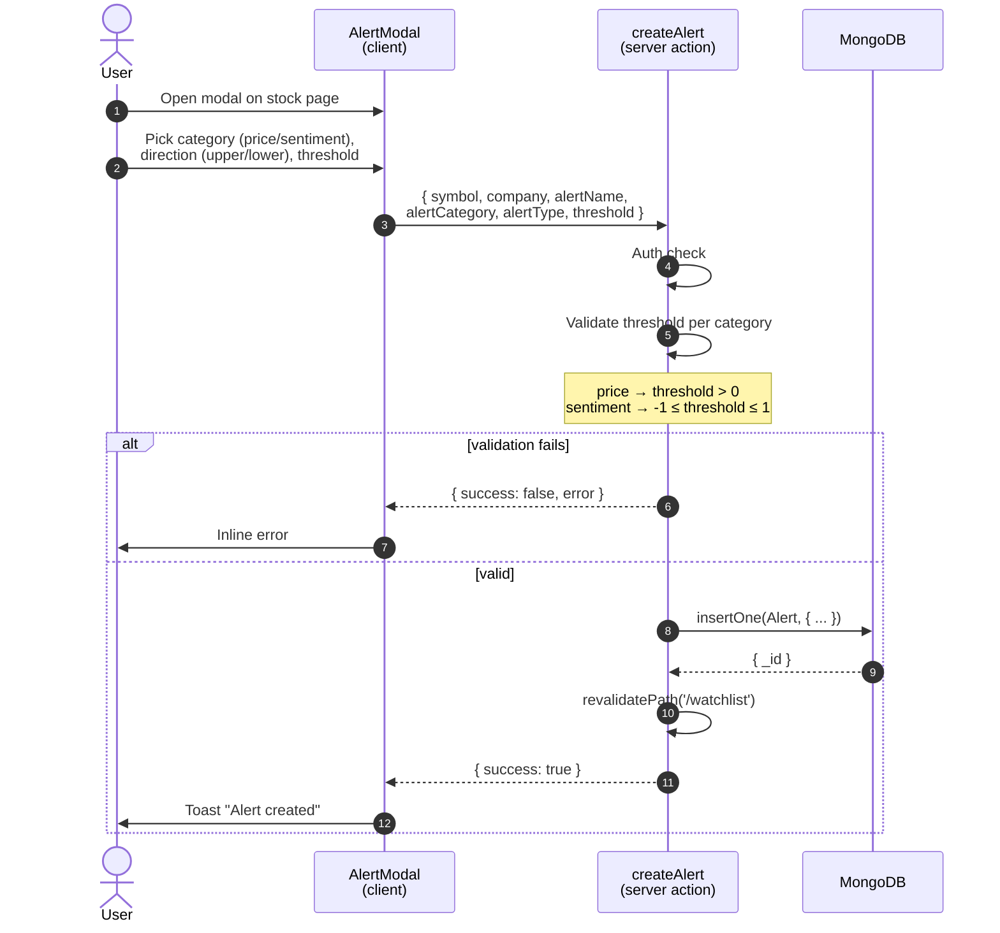
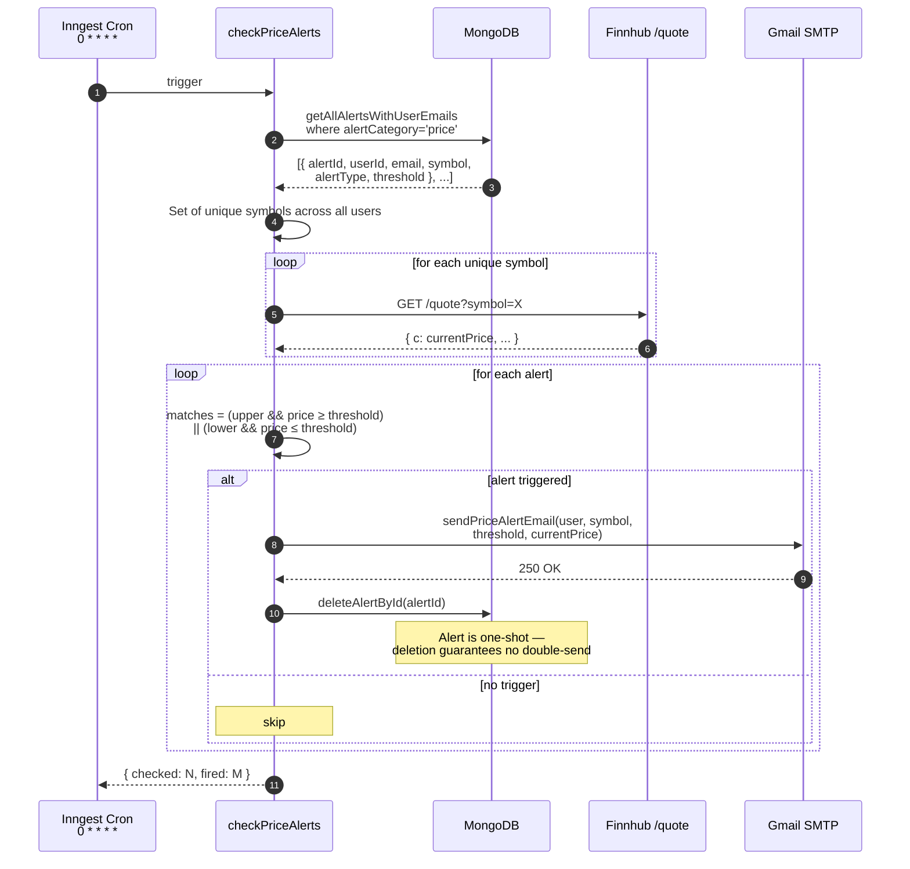

# UML Diagrams — WealthFlow

UML modeling of WealthFlow at three levels of abstraction:

1. **[Use case diagram](#1-use-case-diagram)** — who uses the system and for what.
2. **[Class diagram](#2-class-diagram)** — domain entities + service layer.
3. **[Sequence diagrams](#3-sequence-diagrams)** — how the eight most important flows execute over time.

All diagrams are written in **Mermaid** so they render natively on GitHub *and* can be exported to PNG via <https://mermaid.live> for inclusion in `wealthflow-defense.pptx`. See [§ 4 — Rendering for slides](#4-rendering-for-slides) at the bottom.

> Mermaid does not natively support UML use case notation (the stick figure + ellipse style). The use case diagram below uses a `flowchart`-based convention that conveys the same semantics and renders cleanly. If your PFA jury requires *strict* UML notation, regenerate that one diagram in PlantUML (a `.puml` source is provided as an alternative in [§ 1.1](#11-strict-uml-use-case-plantuml-alternative)).

---

## 1. Use case diagram

Actors (left and right) interact with the use cases (centre, rounded rectangles). Dashed `<<include>>` arrows show mandatory inclusion; the **Inngest Scheduler** is a *time-driven* (non-human) actor that triggers cron-based use cases.



**Reading the diagram:**

- **Three actors:**
  - *Visitor* — unauthenticated, can only do the auth-related use cases.
  - *Authenticated User* — the post-sign-in surface (17 use cases).
  - *Inngest Scheduler* — system actor representing the time-driven background jobs (7 cron-triggered use cases).
- **External systems** are drawn as rectangles on the right. Dashed arrows are "uses" relations (a use case calls into the external service).
- The *Sign up → Send welcome email* dependency is shown as an event-driven include (`app/user.created` event in Inngest).

### 1.1 Strict UML use case (PlantUML alternative)

If your defense requires canonical UML notation (stick figures, ovals), use this PlantUML source instead. Render at <https://www.plantuml.com/plantuml> or via the PlantUML CLI.



---

## 2. Class diagram

Two layers shown together: **domain entities** (Mongoose models, top) and the **service layer** (server-action modules, bottom). Service classes are stereotyped `<<service>>` and external adapters `<<adapter>>`.



**Reading the diagram:**

- **Solid arrows with multiplicities** are persistent associations from the data model (e.g., `User 1 → 0..1 Portfolio`).
- **Dashed arrows (`..>`)** are *uses* relationships: a service depends on a class to do its job, but doesn't *own* the lifecycle.
- **`<<service>>`** classes are the server-action modules in `lib/actions/`. Each maps 1-1 to a file:
  - `AuthService` → `auth.actions.ts`
  - `WatchlistService` → `watchlist.actions.ts`
  - `AlertService` → `alert.actions.ts`
  - `PortfolioService` → `portfolio.actions.ts`
  - `SentimentService` → `sentiment.actions.ts`
  - `ChatService` → `chat.actions.ts`
  - `RecapService` → `recap.actions.ts`
- **`<<adapter>>`** classes wrap external APIs and present a domain-friendly interface (Hexagonal/Ports-and-Adapters style).
- **`<<scheduler>>`** `InngestFunctions` is the orchestrator for all background work — it composes services and adapters but contains minimal business logic itself.

---

## 3. Sequence diagrams

Eight flows total. Four are already in [`PIPELINES.md`](PIPELINES.md) (the most technically deep ones — referenced below to avoid duplication). Three new ones cover the everyday user flows, and one covers the price-alert cron.

### Index

| # | Flow | Source |
|---|---|---|
| 3.1 | Sign-up → welcome email (event-driven) | this file |
| 3.2 | Add to watchlist | this file |
| 3.3 | Create alert (price or sentiment) | this file |
| 3.4 | Trade execution (atomic MongoDB transaction) | [`PIPELINES.md` § 1](PIPELINES.md#1-trade-execution--atomic-with-mongodb-transaction) |
| 3.5 | News sentiment cron + Gemini structured output | [`PIPELINES.md` § 2](PIPELINES.md#2-news-sentiment-pipeline--daily-cron--ai-scoring) |
| 3.6 | Weekly AI recap email | [`PIPELINES.md` § 3](PIPELINES.md#3-weekly-ai-recap-email--multi-step-inngest-workflow) |
| 3.7 | Stock chatbot grounding (request-scoped AI) | [`PIPELINES.md` § 4](PIPELINES.md#4-stock-chatbot-grounding--request-scoped-ai) |
| 3.8 | Hourly price-alert check | this file |

---

### 3.1 Sign-up → welcome email (event-driven)

User signs up. Better-auth creates the user, then the server action fires an `app/user.created` Inngest event. Inngest picks up the event asynchronously, generates a personalized welcome email via Gemini, and sends it via Gmail SMTP. The user is **not** kept waiting on the email.

```mermaid
sequenceDiagram
    autonumber
    actor Visitor
    participant Form as SignUpForm<br/>(client)
    participant Action as signUpWithEmail<br/>(server action)
    participant Auth as better-auth<br/>(MongoDB adapter)
    participant Mongo as MongoDB
    participant Inngest as Inngest
    participant Gemini as step.ai.gemini
    participant Mail as Gmail SMTP

    Visitor->>Form: Fill form + submit
    Form->>Action: { email, password, fullName, country, ... }
    Action->>Auth: auth.api.signUpEmail(...)
    Auth->>Mongo: insert User
    Mongo-->>Auth: { id, email, ... }
    Auth-->>Action: { success, user }

    Action->>Inngest: send("app/user.created", { user })
    Note over Inngest: returns immediately —<br/>email is async
    Action-->>Form: redirect to /

    rect rgb(35, 50, 75)
        Note over Inngest,Mail: Inngest worker (separate process)
        Inngest->>Gemini: step.ai.infer("welcome-email", {<br/>  user profile,<br/>  prompt: personalized welcome<br/>})
        Gemini-->>Inngest: HTML body
        Inngest->>Mail: sendWelcomeEmail(user, html)
        Mail-->>Inngest: 250 OK
    end
```



**Why event-driven and not synchronous:**
A signed-up user doesn't care when the welcome email lands — they care about getting into the app fast. Decoupling shaves ~3s off the perceived sign-up latency and means a flaky Gemini API can never block account creation.

---

### 3.2 Add to watchlist

Simplest mutation in the system, but illustrative because it shows the **toggle** pattern — the same action both adds and removes, deciding from the current DB state.



---

### 3.3 Create alert (price or sentiment)

Same flow shape, two categories. Validation rejects nonsense thresholds (negative price, sentiment outside `[-1, 1]`).



---

### 3.4 – 3.7 (referenced)

These four are the headline pipelines and already documented in detail in [`PIPELINES.md`](PIPELINES.md). Copy them into the deck as-is.

- **3.4** — Trade execution (atomic MongoDB transaction): [`PIPELINES.md` § 1](PIPELINES.md#1-trade-execution--atomic-with-mongodb-transaction)
- **3.5** — News sentiment pipeline (daily cron + Gemini structured output): [`PIPELINES.md` § 2](PIPELINES.md#2-news-sentiment-pipeline--daily-cron--ai-scoring)
- **3.6** — Weekly AI recap email (multi-step Inngest workflow): [`PIPELINES.md` § 3](PIPELINES.md#3-weekly-ai-recap-email--multi-step-inngest-workflow)
- **3.7** — Stock chatbot grounding (request-scoped AI): [`PIPELINES.md` § 4](PIPELINES.md#4-stock-chatbot-grounding--request-scoped-ai)

---

### 3.8 Hourly price-alert check

Cron fires every hour. Symbols are deduplicated across all users before hitting Finnhub. Triggered alerts fire emails *and* delete themselves so they never fire twice.



**Why delete instead of "fired" flag:**
Cheaper read path on subsequent cron runs (only live alerts in the query), no migration when we add a 3rd alert category, and the email is the audit trail. Users who want a recurring alert can simply re-create it after firing — a deliberate UX choice that mirrors how phone-app stock alerts behave.

---

## 4. Rendering for slides

To get crisp PNGs for `wealthflow-defense.pptx`, two options.

### Option A — mermaid.live (no install)

1. Open <https://mermaid.live>.
2. Paste a single Mermaid block (one of the seven Mermaid diagrams above, including the inner content between the triple backticks).
3. *Actions* → *PNG* (or SVG). Save to `screenshots/uml/<name>.png`.
4. Insert into PowerPoint (`Insert → Pictures`).

### Option B — local CLI (Mermaid CLI)

```bash
npm i -g @mermaid-js/mermaid-cli
# Render every Mermaid block in this doc to PNG
mmdc -i docs/UML.md -o screenshots/uml/uml.png -t dark -b transparent
```

`-t dark` matches the WealthFlow dark theme; `-b transparent` lets the PowerPoint slide background show through.

### Suggested slide placement

| Slide | Diagram |
|---|---|
| 7 — Architecture | system flowchart (`ARCHITECTURE.md § 1`) |
| 7b *(new)* — Use cases | **§ 1 above** |
| 8 — Data model | ER (`ARCHITECTURE.md § 4`) |
| 8b *(new)* — Class diagram | **§ 2 above** |
| 9 — Trade execution | `PIPELINES.md § 1` |
| 10 — News sentiment | `PIPELINES.md § 2` |
| 11 — Weekly recap | `PIPELINES.md § 3` |
| 12 — Chatbot | `PIPELINES.md § 4` |
| (appendix slides) | **§ 3.1, 3.2, 3.3, 3.8** for Q&A backup |

If the jury asks "show me X" during Q&A, having the four extra sequence diagrams ready as hidden slides is cheap insurance.
